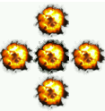
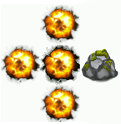

# Projet de programmation C

Réalisation d'un jeu vidéo 2D : **bombeirb**.


## Organisation

Le travail est à réaliser en équipe de un à deux étudiants appartenant au même groupe (A, B ou C). Vous devez au préalable former les équipes et les nommer de la forme *GA-T1* pour l'equipe *1* du groupe *A*. 

Nous utilisons la plateforme GitHub pour héberger vos projets. Pour ce faire, vous devez créer un compte utilisateur sur GitHub si vous n'en possédez pas encore. Cliquer ensuite sur le lien [suivant](https://classroom.github.com/g/xY-oPa2P) pour créer votre équipe. Utiliser la convention de nommage précédente. 

Vous avez les droits administrateur sur votre dépôt et celui-ci est privé (GitHub education). Ajouter l'autre membre du groupe. Le dépôt devrait être initialisé avec le contenu de ce dépôt. Vous pouvez maintenant commencer à travailler.


## Principes du jeu

Une princesse est détenue prisonnière par de méchants monstres verts. Votre mission, si vous l'acceptez, est d'aller la délivrer. Pour cela, vous devrez traverser plusieurs mondes, plus effrayants les uns que les autres. Des portes vous permettront de passer de mondes en mondes. Certaines portes seront fermées à clés et nécessiterons d'avoir une clé dans votre inventaire. Vous êtes un expert en explosif et utiliserez vos bombes pour détruire les obstacles devant vous et tuer les monstres qui vous attaquerons.


## Représentation du jeu

Chaque monde est représenté par une carte (rectangulaire) composée de cellules. Chaque cellule peut contenir :

-   le joueur ou la princesse
-   des éléments de décors (arbres, pierres...) infranchissables et
    indestructibles ;
-   des caisses destructibles;
-   des portes, ouvertes ou fermées, permettant d’évoluer entre les
    mondes ;
-   des clefs pour débloquer les portes fermées ;
-   des bonus ou des malus


## Prise en main

Nous vous fournissons une première ébauche du jeu, utilisant les
bibliothèques [SDL](https://www.libsdl.org) (Simple DirectMedia Layer) et son extension
*SDL_image* pour l’interface utilisateur et la gestion du 2D. Le
programme a été testé sur Linux, MacOS et Windows. Le lancement du jeu
fait apparaitre une [carte](img/bombeirb.png), chargée statiquement en mémoire, dans laquelle le joueur peut se déplacer sans limite dans
toutes les directions quelque soit la nature des cellules.


## Codage des cartes

Une carte de taille `Largeur x Hauteur` est représentée sous la forme
d’un tableau à une dimension tel que la cellule de coordonnées `(i,j)`
sur la carte corresponde à l’élément d’indice `(i + j*Hauteur)` dans le
tableau. La valeur d’un élément du tableau représente le type de la
cellule correspondante. Cette valeur est codé par un entier sur 8 bits
non signé `(unsigned char)`. Le codage de chaque cellule est définit de la
manière suivante:

<center>
<table>
   <tr>
       <td>b7</td>
       <td>b6</td>
       <td>b5</td>
       <td>b4</td>
       <td>b3</td>
       <td>b2</td>
       <td>b1</td>
       <td>b0</td>
   </tr>
</table>
</center>

Les 4 bits de poids forts (b7 - b4) représentent le type de la
cellule avec le codage suivant :

-   **0** : Vide
-   **1** : Décor (arbres et pierres)
-  **2** : Caisse
-  **3** : Porte
-  **4**  : Clé
-  **5** : Bonus / Malus
-  **6** : Monstre
-  **7** : Bombe

 

Les 4 bits de poids faibles (b3 - b0) codent le sous-type de la
cellule ou des informations complémentaires.

#### Décor

Les bits b3 à b2 codent le type de décor: **0** pour une pierre, **1** pour un arbre et **2** pour la princesse. Les bits b1 à b0 sont inutilisés.

#### Caisse

Les bits b3 - b0 codent ce qui se trouve dans la caisse avec le
codage suivant

-   **0** : Vide
-   **1** : Diminue la puissance des bombes
-   **2** : Augmente la puissance des bombes
-   **3** : Diminue le nombre de bombes
-   **4** : Augmente le nombre de bombes
-   **5** : Monstre
-   **6** : Vie supplémentaire

#### Porte

Le bit b0 code l’état de la porte : **0** = fermée, **1** = ouverte. Les
bits b3-b1 codent le numéro de la carte atteignable en
franchissant la porte (8 niveaux maximum possibles).

Travail à fournir
=================

Il vous est demandé de compléter l’ébauche de jeu fournie, de produire un court rapport d’au plus deux pages, ainsi que de faire une démonstration de votre implantation des fonctionnalités demandées. Le rapport devra contenir, pour chaque fonctionnalité ajoutée, une description de la solution adoptée. Il devra être remis au format `PDF`.
Votre code devra être clairement commenté et indenté. Les fonctions seront nommées en anglais. Les fonctionnalités demandées constituent un cadre obligatoire à partir duquel vous êtes libres d’agrémenter le jeu comme vous l’entendez. Nous décrivons ci-après les fonctionnalités attendues du jeu.


Gestion des déplacements
------------------------

Les mouvements du joueur sont limités par le cadre de la carte, les éléments de décors et les caisses. Les caisses doivent pouvoir être déplacées par le joueur si rien ne gêne dans le sens de la poussée. Si un bonus se trouve dans la direction déplacement d’une caisse, la caisse reste bloquée. Le joueur ne peux pas déplacer deux caisses à la fois.

Gestion des mondes
------------------

Les cartes sont décrites dans des fichiers dans le dossier `map` et
chargées en mémoire par le programme. Nous définissons les conventions
suivantes :

-   Les cartes sont stockées sous forme de fichiers texte afin de
    pouvoir les créer et les modifier avec un simple éditeur de texte ;
-   Le nom de fichier d’une carte est de la forme `map_N` ou `N` est le
    numéro du niveau;
-   La première ligne du fichier, de la forme `width x height`,
    représente la largeur et la hauteur de la carte (valeurs décimales);
-   La case en haut à gauche de la carte correspond aux coordonnées
    `(0,0)` ;
-   Chaque ligne correspond à une ligne de cellule sur la carte; Chaque
    cellule est suivie par un au moins un espace (y compris la dernière
    cellule d’une ligne);
-   Chaque cellule de la carte est définie en respectant le codage
    défini au début du sujet, en format décimal. Ainsi, une porte
    ouverte donnant accès au niveau 5 donne un codage binaire de
    `[0011][101][1]` = 59 en décimal.

Comme nous n’utilisons que 3 bits pour coder les différentes carte du jeu, il y a un maximum de 8 niveaux possibles. Le premier niveau est toujours le niveau **0**. L’exemple ci-dessous illustre le codage d’une carte de 3 par 2. Le symbole `_` représente un espace.

<pre>
3 x 2
2 _ 0 _ _ 1 7
0 _ 5 9 _ 0 _
</pre>

### Chargement des cartes

Écrire les fonctions permettant de charger une carte à l’écran à partir
d’un fichier. Pour représenter une partie, nous utiliserons un fichier supplémentaire, lui aussi au format texte, dans le répertoire data. Ce fichier aura le format suivant :

- La première ligne contient le numéro de niveaux
- La seconde ligne indique la position du joueur sous la forme `level : x, y` où *level* est le numéro du monde, x* et *y* sont les coordonnées sur la carte correspondante.
- La troisième ligne indique le préfixe des fichiers cartes correspondants dans le répertoire *map*. L'exemple ci-dessous représente une partie avec 3 mondes dont chaque carte est de la forme `easy_N`. Le joueur se trouve sur la case en haut à gauche du premier niveau. Au chargement de la partie, il faut afficher le niveau sur lequel se trouve le joueur.

```

3
0:0,0
easy
```

### Gestion des portes

Lorsque le joueur arrive sur la case d’une porte ouverte, il passe
automatiquement au niveau correspondant à cette porte (niveau supérieur
ou inférieur). Seul le niveau *0* n'a qu'une seule porte (on ne peut pas passer au niveau inférieur). Il se retrouve automatiquement sur la porte du niveau
correspondant. Si la porte est fermée, le joueur doit utiliser une des
clefs de son inventaire. Une fois utilisée, la clé disparait de
l’inventaire. Chaque clef peut ouvrir indifféremment n’importe quelle
porte. Une fois qu'une porte est ouverte, elle le reste pour toute la partie du jeu.

### Gestion du panneau d’informations

Le panneau d’information doit afficher le nombre de vies, le nombre de
bombes et leur portée, le nombre de clés dans l’inventaire et le numéro
de niveau courant.
     
Gestion des bombes
------------------

Lorsque le joueur presse la touche `[ESPACE]`, il dépose une bombe sur
la case sur laquelle il se trouve, déclenchant une explosion au bout de
4 secondes. La mèche de la bombe diminue à chaque seconde. La portée de
la bombe est par défaut de 1 case, en croix (case du dessus, case du
dessous, case de gauche, case de droite). Les éléments de décor stoppent
la propagation de l’explosion dans le sens qu’ils obstruent. Si une caisse est sur le chemin de l’explosion, elle
disparait pour laisser apparaitre son contenu. Une explosion ne peut
détruire qu’une seule caisse dans une même direction. Si un bonus, un
malus ou un monstre est sur le chemin de l’explosion, il disparait.
Enfin, si le joueur est sur une cellule touchée par une explosion, il
perd une vie. Les explosions n’ont aucun effet sur les portes et les
clefs. Lorsque une bombe explose, une nouvelle bombe est ajoutée à
l’inventaire du joueur.

#### Exemple d’explosions d’une bombe de portée 1 sans obstacle


 
#### Exemple d’explosions d’une bombe de portée 1 avec obstacle


 

Gestion des bonus et malus
--------------------------

Les bonus et malus peuvent être sur la carte ou apparaitre lors de
l’explosion d’une caisse. Il en existe 5 :

-   **portée-** / **portée+** : ajoute/retire 1 à la portée des bombes.
    La portée ne peut pas être nulle. Le changement de portée ne
    concerne que les bombes qui seront posées plus tard. Les bombes pour
    lesquelles la mèche est déjà allumée conservent leur portée
    initiale.

-   **bomb-** / **bomb+** : ajoute/enlève une bombe à l’inventaire. Le
    joueur dispose toujours d’au minimum 1 bombe.
eas
-   **vie+** : ajoute une vie

Gestion des vies
----------------

Le joueur dispose de 2 vies au démarrage du jeu. Il peut en perdre s’il
se trouve sur une case à portée de l’explosion d’une bombe. Si le joueur
n’a plus de vie, la partie se termine.

Gestion des monstres
--------------------

Les monstres peuvent être présents dès le chargement de la carte ou
apparaitre à l’explosion d’une caisse. Leurs déplacements sont
entièrement aléatoires. Une collision avec un monstre déclenche la perte
d’une vie. Le joueur bénéficie alors d’une temporisation pendant lequel
il est invulnérable.

Commencez par ajouter un seul monstre à la fois, puis augmenter le
nombre de monstres. La vitesse de déplacement des monstres doit être
faible dans les premiers niveaux et augmenter plus on se rapproche de la
princesse. Ceux qui le souhaite peuvent ajouter un module d’intelligence
artificielle pour que les monstres se dirigent vers le joueur et non
plus aléatoirement.

Les monstres ne peuvent pas ramasser les bonus qui se trouvent sur le
sol. Les monstres ont peur des portes et ne peuvent s’approcher à moins
de 1 case d’une porte.

Fin de partie
-------------

La partie est finit lorsque le joueur arrive sur la case de la
princesse. Les monstres ne veulent pas de mal à la princesse mais feront
tout pour la garder prisonnière

Pause
-----

La touche `[P]` met le jeu en pause et permet de reprendre la partie. Si
une ou plusieurs bombes ont été posées et n’ont pas encore explosé lors
de la pause, le temps avant leur explosion doit être le même lors de la
reprise du jeu.

Sauvegarde / Chargement partie
------------------------------

On souhaite pouvoir enregistrer une partie en cours. Il faut sauvegarder
l’état d’avancement du joueur, son nombre de vies et de bombes, sa
position sur la carte en cours, le nombre de clefs dans son inventaire,
l’état des cartes du niveau (monstres, décor). Une fois que
l’enregistrement est effectué, il faut permettre de recharger la partie
enregistrée. Le choix du format d’enregistrement est libre.
